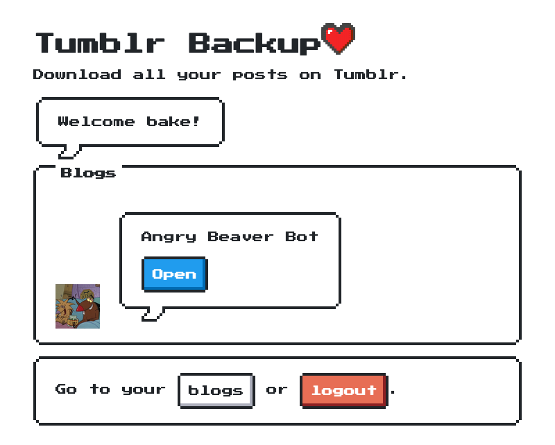

# tumblr-backup

Tumblr Backup is a simple webservice to download a blog. Supported post types
are _text_, _ask_ and _photo_. Posts and their contents are downloaded from
Tumblr and streamed directly into the ZIP the client is downloading.

## Development

[Register a Tumblr application](https://www.tumblr.com/oauth/apps) and enter its
OAuth key and secret in `.env`.

This project uses [Buffalo](http://gobuffalo.io) so simply use `$ buffalo dev`
to run the development server. Use `$ buffalo build` to build.

## Screenshots

### Login

### Blog overview

### Single blog

## Dependencies

- [gobuffalo/buffalo](https://github.com/gobuffalo/buffalo)
- [nostalgic-css/NES.css](https://github.com/nostalgic-css/NES.css/)
- [bake/gotumblr](https://github.com/bake/gotumblr)
